# 🤖 AI Engine v5 - Complete Architecture Guide

**For Future Developers, AIs, and Maintainers**

This document explains **why** AI Engine v5 exists, **what problems** it solves, and **how** the system works. If you're reading this in the future (human or AI), this will help you understand the context and continue the work effectively.

---

## 📋 **Table of Contents**

1. [The Problem Story](#-the-problem-story)
2. [Why V5 Was Created](#-why-v5-was-created)
3. [V5 Solution Architecture](#-v5-solution-architecture)
4. [Data Organization](#-data-organization)
5. [Meet Rony: The Autonomous Scraper](#-meet-rony-the-autonomous-scraper)
6. [Deployment & Operations](#-deployment--operations)
7. [Future Modifications Guide](#-future-modifications-guide)

---

## 📖 **The Problem Story**

### **What We Were Building**
Better French is a language learning platform that provides:
- Daily French news articles
- Simplified for B1-B2 learners
- Vocabulary tooltips and explanations
- Educational content extraction

### **How Previous Versions Worked**
- **V1-V2**: Basic scraping and manual processing
- **V3**: Automated scraping + AI enhancement with Gemini
- **V4**: Added GPT-4o verification for quality improvement

### **The Critical Problems We Faced**

#### 🚨 **Problem #1: Development vs Production Conflict**
```
Developer testing → API keys exposed in public repo → OpenRouter disables keys → Scraper dies → Manual fix needed
```

**Real Impact:**
- Every development session broke production
- Autonomous scraper stopped working randomly
- Manual intervention required constantly
- No reliable 24/7 operation possible

#### 🚨 **Problem #2: Bulk Processing Chaos** 
```
V3+V4 tried to process 1000+ articles at once → Workflows crashed → Unpredictable costs → Failed runs
```

**Real Impact:**
- Workflows timed out processing huge batches
- $50+ surprise bills from bulk LLM processing
- Unreliable article delivery
- Complex debugging of failed runs

#### 🚨 **Problem #3: Repeated Scraping Waste**
```
Development/testing → Scraper runs again → Same sources scraped → Wasted API calls → Slow iteration
```

**Real Impact:**
- Development was slow and expensive
- Each test required re-scraping all sources
- No way to work with cached data
- Inefficient development cycle

#### 🚨 **Problem #4: "Heat Wave Spam"**
```
Multiple sources report same story → 5 heat wave articles selected → Poor diversity → User experience suffers
```

**Real Impact:**
- Repetitive content in daily selection
- Users complained about duplicate topics
- Poor learning experience
- Manual curation needed

---

## 🎯 **Why V5 Was Created**

**Core Insight**: The problem wasn't the AI enhancement pipeline (V3+V4 was excellent). The problem was **WHEN** and **HOW** we ran it.

**V5 Mission**: 
> "Preserve V3+V4 quality while making it autonomous, reliable, and development-friendly through separated workflows."

**Key Principles:**
1. **Separation of Concerns**: Scraping ≠ Processing
2. **API Key Security**: Development can't break production
3. **Data-Driven**: Work with stored data, not live scraping
4. **Cost Predictability**: Small, controlled LLM usage
5. **Quality Preservation**: Same comprehensive sources as V3+V4

---

## 🏗️ **V5 Solution Architecture**

### **The Separated Workflow Approach**

```mermaid
graph TD
    A[🤖 Rony: Autonomous Scraper] -->|Every Hour| B[📦 scraper_data.json]
    B -->|File Detection| C[🌐 Website Processor]
    C -->|Enhanced Articles| D[🚀 Better French Website]
    
    E[🔐 Protected API Key] --> A
    F[🔧 Dev API Key] --> C
    
    A -->|30+ Sources| G[📡 Comprehensive RSS Feeds]
    A -->|LLM Selection| H[🧠 Gemini 2.5 Flash: Top 10]
    C -->|V3 Enhancement| I[🎨 Gemini 2.0 Flash: Simplify]
    C -->|V4 Verification| J[✨ GPT-4o Mini: Verify]
```



### **Workflow 1: Rony the Autonomous Scraper**

**Purpose**: Reliable, comprehensive news collection
**Frequency**: Every hour
**API Key**: `OPENROUTER_SCRAPER_API_KEY` (Rony's protected key)

**Process**:
1. ✅ Check if current hour already processed (avoid duplicates)
2. 📡 Scrape 31 comprehensive RSS sources
3. 🧠 Use Gemini 2.5 Flash to select top 10 articles
4. 💾 Store results in `scraper_data.json`
5. 📊 Track costs, sources, and status
6. ⏭️ Exit (no heavy processing)

**Cost**: ~$0.01-0.05 per hour
**Reliability**: Protected API key ensures it never breaks

### **Workflow 2: Website Processor**

**Purpose**: Apply V3+V4 enhancement pipeline to new articles
**Frequency**: Every 30 minutes (detects new articles)
**API Key**: `OPENROUTER_API_KEY` (can fallback to Rony's key)

**Process**:
1. 🔍 Check `scraper_data.json` for unprocessed articles
2. 🚦 Skip if no new articles (efficient)
3. 🎨 Apply V3 enhancement (Gemini 2.0 Flash)
4. ✨ Apply V4 verification (GPT-4o Mini)
5. 🌐 Generate enhanced website
6. 📝 Mark articles as processed

**Cost**: ~$0.10-0.50 per batch (only when needed)
**Result**: Same quality as V3+V4 but autonomous

---

## 📊 **Data Organization**

### **Single File Approach: `scraper_data.json`**

V5 uses a single, clean data file that contains everything:

```json
{
  "scraper_state": {
    "last_processed_hour": "2024-01-15T10:00:00",
    "total_hours_processed": 245,
    "last_run_status": "success"
  },
  "collected_articles": [
    {
      "hour": "2024-01-15T10:00:00",
      "articles": [
        {
          "title": "Article title",
          "summary": "Article summary",
          "link": "https://...",
          "source": "Le Monde",
          "published_date": "..."
        }
      ],
      "selection_reasoning": "LLM explanation of why these were chosen",
      "processed_by_website": false,
      "cost": 0.023,
      "candidate_count": 156,
      "sources_scraped": 31
    }
  ]
}
```

**Benefits of This Structure:**
- ✅ **Single source of truth**: Everything in one place
- ✅ **Status tracking**: Know what's processed vs pending
- ✅ **Cost tracking**: Monitor LLM usage
- ✅ **Debugging friendly**: Easy to inspect state
- ✅ **Development friendly**: Work with stored data
- ✅ **Cleanup automatic**: Keeps only last 48 hours

### **File Lifecycle**

1. **Rony writes**: New hourly article selections
2. **Website processor reads**: Detects unprocessed articles  
3. **Website processor updates**: Marks articles as processed
4. **Automatic cleanup**: Removes old data (48+ hours)

---

## 🤖 **Meet Rony: The Autonomous Scraper**

**Rony's Profile:**
- **Full Name**: Autonomous Scraper (nicknamed Rony)
- **Job**: Reliable, 24/7 French news collection
- **API Key**: `OPENROUTER_SCRAPER_API_KEY` (stored securely in GitHub Secrets)
- **Personality**: Reliable, never breaks, comprehensive coverage

**Rony's Sources (31 comprehensive RSS feeds):**

```
📰 Major Newspapers (9):
├── Le Monde (main + 6 categories)
├── Le Figaro  
├── Libération
├── Le Parisien
├── L'Express
├── Le Point
├── L'Obs
├── La Croix
└── Les Échos

📺 TV/Radio (6):
├── BFM TV
├── France Info (main + 5 categories)  
├── France Inter
├── Europe 1
├── France 24
└── RFI

🌍 Regional/Specialized (3):
├── Ouest France
├── 20 Minutes  
└── AFP

🎨 Alternative (2):
├── Mediapart
└── Brief.me
```

**Rony's Intelligence:**
- Uses Gemini 2.5 Flash for article selection
- Considers educational value for French learners
- Ensures topic diversity (no "heat wave spam")
- Tracks source reliability and performance

**Security Features:**
- Protected API key never exposed in development
- Separate from development API keys
- Automatic error recovery
- Graceful handling of source failures

---

## 🚀 **Deployment & Operations**

### **GitHub Actions Workflows**

**File**: `.github/workflows/data_collection.yml`
```yaml
# Rony's workflow - runs every hour
name: V5 Autonomous Scraper (Hourly)
trigger: cron '0 * * * *'
environment: OPENROUTER_SCRAPER_API_KEY (Rony's key)
```

**File**: `.github/workflows/ai_processing.yml`
```yaml
# Website processor - runs every 30 minutes
name: V5 Website Processor (File Detection)  
trigger: cron '*/30 * * * *'
environment: OPENROUTER_API_KEY (dev key, can fallback to Rony's)
```

### **Required GitHub Secrets**

```bash
# Set these in GitHub repository settings:
OPENROUTER_SCRAPER_API_KEY=sk-or-v1-[rony-api-key-here]
OPENROUTER_API_KEY=sk-or-v1-[your-development-key-here]
```

### **Monitoring & Health Checks**

**Scraper Health**:
- Check `scraper_data.json` for recent updates
- Monitor `last_run_status` field
- Track `total_hours_processed` growth

**Website Health**:
- Check GitHub Pages deployment
- Monitor processing costs
- Verify articles marked as processed

**Cost Monitoring**:
- Rony: ~$0.01-0.05 per hour = $7-36/month
- Website: ~$0.10-0.50 per batch = $15-75/month  
- Total: ~$22-111/month (predictable!)

---

## 🔧 **Future Modifications Guide**

### **Changing LLM Models**

**To change Rony's selection model:**
```python
# In autonomous_scraper.py
self.selection_model = os.getenv('AI_ENGINE_SELECTION_MODEL', 'new-model-here')
```

**To change V3/V4 enhancement models:**
```python
# In website_processor.py  
self.v3_model = os.getenv('AI_ENGINE_V3_MODEL', 'new-v3-model')
self.v4_model = os.getenv('AI_ENGINE_V4_MODEL', 'new-v4-model')
```

### **Adding New RSS Sources**

**Edit**: `ai_engine_v5/core/scraper/autonomous_scraper.py`
```python
self.sources = [
    # ... existing sources ...
    "https://new-source.com/rss.xml",  # Add here
]
```

**Don't forget to**:
- Add source name mapping in `_get_source_name()`
- Test with the comprehensive test suite
- Update this README with new source count

### **Modifying Selection Criteria**

**The LLM prompt is in**: `autonomous_scraper.py` → `llm_select_top_10()`

**Current criteria**:
- Educational value for French learners (B1-B2 level)
- Diverse topics (avoid duplicates/similar stories)
- Current relevance and importance
- Clear, well-written French
- Interesting content that motivates learning
- Mix of categories (politics, culture, economy, society, etc.)

**To modify**: Edit the prompt string with new criteria

### **Changing Data Retention**

**Current**: 48 hours of data kept
**To change**: Edit cleanup logic in `autonomous_scraper.py`
```python
# Keep only last X hours of data
if len(scraper_data["collected_articles"]) > X:
    scraper_data["collected_articles"] = scraper_data["collected_articles"][-X:]
```

### **Adding New Enhancement Steps**

**Architecture supports**: V3 → V4 → V5 → V6 → etc.

**To add V6 enhancement**:
1. Create new method in `website_processor.py`
2. Call it after V4 enhancement
3. Update cost calculations
4. Test with small batches first

### **API Key Management**

**Adding new API provider**:
1. Add new environment variable
2. Update both workflows
3. Add fallback logic in processors
4. Test with protected keys first

---

## 🎯 **Success Metrics**

**V5 is successful when:**
- ✅ Rony runs every hour without breaking (99%+ uptime)
- ✅ 10 high-quality articles delivered daily
- ✅ Development doesn't interfere with production
- ✅ Costs are predictable ($20-100/month)
- ✅ Same quality as V3+V4 (user satisfaction maintained)
- ✅ Zero manual intervention required

**Key Performance Indicators:**
- **Reliability**: Hours processed / Hours attempted  
- **Quality**: User engagement with selected articles
- **Efficiency**: Cost per quality article delivered
- **Autonomy**: Days without manual intervention

---

## 📞 **Contact & Context**

**This system was designed by**: Claude (AI Assistant) working with the Better French team
**Date**: January 2025
**Context**: Solving production reliability and development efficiency problems
**Goal**: Autonomous, high-quality French news curation for language learners

**For future maintainers**: This document should help you understand not just HOW the system works, but WHY it was built this way. The separated workflow approach was the key insight that solved multiple problems simultaneously.

**Remember**: Rony is not just a scraper - he's the reliable foundation that makes everything else possible! 🤖

---

*"From chaos to autonomous excellence - that's the V5 story."* 