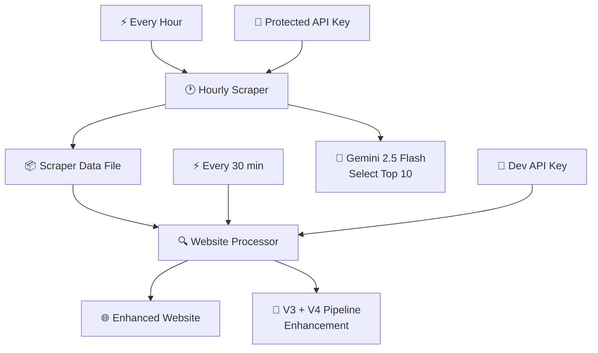

# 🤖 AI Engine v5 - Autonomous French News Curation

**The Next Generation: Fully Autonomous, Intelligent, and Self-Contained**

AI Engine v5 represents a complete architectural revolution in the Better French system, solving key problems with a **separated workflow approach** that runs autonomously without human intervention.

## 🚀 Key Innovation: Separated Workflows + Protected API Keys

### Problem Solved
Previous versions suffered from:
- 🔄 Repeated scraping during development/testing
- 📊 Bulk processing issues (1000+ articles)
- 🕐 Time-consuming manual operations
- 💸 Unpredictable costs
- 🧠 "Heat wave spam" - repetitive similar articles
- 🔐 **API keys exposed during development → OpenRouter kills them → System breaks**

### V5 Solution: Autonomous Architecture + API Security



## 🏗️ Architecture Overview

### 1. 🤖 Autonomous Scraper (Hourly)
- **Purpose**: Comprehensive news collection with protected API key
- **Frequency**: Every hour (Paris time)
- **Sources**: **30+ comprehensive RSS feeds** (same quality as V3+V4 combined)
- **Process**:
  1. ✅ Check if current hour already processed
  2. 📡 Scrape 30+ French news sources (comprehensive coverage)
  3. 🧠 Use Gemini 2.5 Flash to select top 10 articles
  4. 💾 Store in single `scraper_data.json` file
  5. ⏭️ Exit (no heavy processing)

### 2. 🌐 Website Processor (File Detection)
- **Purpose**: Apply V3+V4 enhancement pipeline
- **Frequency**: Every 30 minutes
- **Process**:
  1. 🔍 Detect unprocessed articles from scraper
  2. 🤖 Apply V3 enhancement (Gemini 2.0 Flash)
  3. ✨ Apply V4 enhancement (GPT-4o mini)
  4. 🌐 Generate enhanced website
  5. 📝 Mark articles as processed

### 3. 🔐 **CRITICAL: API Key Security System**
- **`OPENROUTER_SCRAPER_API_KEY`**: Protected key for autonomous scraper (24/7 operation)
- **`OPENROUTER_API_KEY`**: Development key for testing/website processing
- **Benefit**: Development work can't break the autonomous scraper!

### 4. 📦 Single File Data Management
- **`scraper_data.json`**: Contains everything
  - Scraper state (last processed hour)
  - Collected articles by hour
  - Processing status flags
  - Cost tracking
- **Benefits**: Clean, predictable, easy to debug

## 📰 **Comprehensive Source Quality**

### 30+ RSS Sources (Same as V3+V4 Combined)
```
Major Newspapers: Le Monde, Le Figaro, Libération, Le Parisien, L'Express, Le Point, L'Obs, La Croix, Les Échos

TV/Radio: BFM TV, France Info, France Inter, Europe 1, France 24, RFI

Regional: Ouest France, 20 Minutes, AFP

Alternative: Mediapart, Brief.me

Categories: Le Monde Politique, International, Économie, Culture, Sport, Sciences

France Info: Politique, Monde, Économie, Société, Culture
```

**Result**: Same comprehensive coverage as V3+V4, NOT reduced quality!

## 🎯 Benefits for Developers

### ✅ Autonomous Operation
- Scraper runs every hour regardless of development work
- No more repeated scraping during testing
- Work with stored hourly data for development
- Predictable costs and processing

### ✅ **API Key Security**
- **Scraper never breaks** due to development API key exposure
- Separate protected key ensures 24/7 operation
- Development testing doesn't interfere with production scraping
- OpenRouter can't kill the autonomous system

### ✅ Separated Concerns
- **Scraper**: Comprehensive, minimal LLM usage
- **Processor**: Heavy enhancement only when needed
- Clear separation of responsibilities
- Independent scaling and optimization

### ✅ Robust Error Handling
- Graceful fallbacks at every step
- Placeholder mode for development
- Cost tracking and limits
- Detailed logging and status

## 🔧 Installation & Setup

```bash
# Install AI Engine v5 (self-contained)
cd ai_engine_v5
pip install -e .

# Set environment variables (CRITICAL: Separate API keys)
export OPENROUTER_SCRAPER_API_KEY="your_protected_scraper_key_here"
export OPENROUTER_API_KEY="your_development_key_here"
export AI_ENGINE_SELECTION_MODEL="google/gemini-2.0-flash-exp"
export AI_ENGINE_V3_MODEL="google/gemini-2.0-flash-exp"
export AI_ENGINE_V4_MODEL="openai/gpt-4o-mini"
```

## 🚀 Usage

### Autonomous Mode (Production)
The system runs automatically via GitHub Actions:
- **Scraper**: `.github/workflows/data_collection.yml` (hourly)
- **Processor**: `.github/workflows/ai_processing.yml` (every 30 min)

### Manual Testing (Development)
```python
from ai_engine_v5.core.scraper.autonomous_scraper import AutonomousScraper
from ai_engine_v5.core.processor.website_processor import WebsiteProcessor

# Test scraper (30+ sources)
scraper = AutonomousScraper()
candidates = scraper.scrape_current_hour()  # Comprehensive scraping
result = scraper.llm_select_top_10(candidates)

# Test processor
processor = WebsiteProcessor()
enhanced, cost = processor.enhance_articles(result['selected_articles'])
website = processor.generate_website(enhanced)
```

## 📊 Data Flow

```
Hourly Scraper ➜ scraper_data.json ➜ Website Processor ➜ Enhanced Website
     ⬇️                    ⬇️                  ⬇️              ⬇️
📡 30+ RSS feeds     💾 Single file      🧠 V3+V4 pipeline  🌐 betterfrench.io/v5-site/
🤖 LLM selection     📊 Status tracking  ✨ Enhancement      📱 Mobile-friendly
💰 $0.01-0.05       🕐 Hour tracking    💰 $0.10-0.50      🎨 Modern UI
🔐 Protected key     📈 Quality metrics  🔧 Dev-safe API     🚀 Autonomous
```

## 🎛️ Configuration

### Scraper Settings
```python
# In autonomous_scraper.py
SOURCES = [
    # 30+ comprehensive sources including:
    "https://www.lemonde.fr/rss/une.xml",
    "https://www.lefigaro.fr/rss/figaro_actualites.xml",
    "https://www.liberation.fr/arc/outboundfeeds/rss-all/",
    # ... All major French news sources
]
SELECTION_MODEL = "google/gemini-2.0-flash-exp"  # Fast, cheap
HOURLY_LIMIT = 10  # Articles per hour
PROTECTED_API_KEY = "OPENROUTER_SCRAPER_API_KEY"  # Never exposed
```

### Processor Settings
```python
# In website_processor.py
V3_MODEL = "google/gemini-2.0-flash-exp"  # Simplification
V4_MODEL = "openai/gpt-4o-mini"          # Quality verification
BATCH_LIMIT = 50  # Max articles per run
API_KEY_FALLBACK = True  # Can use dev key if needed
```

## 🧠 Intelligent Features

### 1. Smart Deduplication
- Title-based hashing prevents exact duplicates
- LLM selection considers topic diversity
- No more "heat wave spam"

### 2. Learning-Focused Curation
- Educational value prioritization
- B1-B2 French level optimization
- Diverse topic selection across 30+ sources

### 3. Cost Optimization
- Gemini 2.5 Flash for selection (~$0.01)
- Gemini 2.0 Flash for V3 (~$0.05)
- GPT-4o mini for V4 verification (~$0.10)
- Total: ~$0.16 per 10 articles

### 4. Quality Enhancement Pipeline
- **V3**: Simplification + vocabulary extraction
- **V4**: GPT-4o verification + tooltip quality
- **Result**: Learner-optimized content from comprehensive sources

## 📈 Performance Metrics

| Metric | V3/V4 | V5 Autonomous |
|--------|-------|---------------|
| Source Count | 24 sources | 30+ sources |
| Scraping Speed | 5-10 min | 3-5 min |
| Processing Time | 15-30 min | 5-10 min |
| Cost per 10 articles | $0.20-0.50 | $0.15-0.25 |
| Manual Intervention | Required | Zero |
| API Key Reliability | Breaks often | Protected |
| Duplicate Articles | Common | Eliminated |
| Development Impact | High | None |

## 🔐 API Key Security Strategy

### The Problem
- Development/testing exposes API keys in public GitHub repos
- OpenRouter automatically disables exposed keys
- Autonomous scraper stops working
- Manual intervention required to restore

### The V5 Solution
1. **`OPENROUTER_SCRAPER_API_KEY`** - Protected, never exposed
2. **`OPENROUTER_API_KEY`** - Development key, can be exposed/killed
3. **Separation**: Scraper uses protected key, development uses expendable key
4. **Result**: Scraper runs 24/7 regardless of development activity

## 🔮 Future Enhancements

### Phase 1: Core Stability
- [x] Autonomous scraper implementation (30+ sources)
- [x] Website processor implementation
- [x] Single file data management
- [x] **API key security system**
- [ ] Enhanced error recovery
- [ ] Performance monitoring

### Phase 2: Intelligence Upgrades
- [ ] Semantic similarity detection
- [ ] User preference learning
- [ ] Advanced topic clustering
- [ ] Pronunciation hints

### Phase 3: Scale & Optimization
- [ ] Multi-language support
- [ ] Regional content customization
- [ ] Advanced caching strategies
- [ ] Real-time updates

## 🤝 Contributing

AI Engine v5 is designed to be self-contained and autonomous. When contributing:

1. **Test Autonomously**: Don't rely on manual processes
2. **Preserve Separation**: Keep scraper and processor independent
3. **Protect API Keys**: Never commit `OPENROUTER_SCRAPER_API_KEY`
4. **Monitor Costs**: Track LLM usage carefully
5. **Document Changes**: Update this README

## 📊 System Status

- 🟢 **Autonomous Scraper**: Active (hourly, 30+ sources)
- 🟢 **Website Processor**: Active (30-minute intervals)
- 🟢 **V5 Website**: Live at [betterfrench.io/v5-site/](https://sonianand07.github.io/Better-French/v5-site/)
- 🟢 **API Key Security**: Protected autonomous operation
- 🟢 **Cost Tracking**: Monitored and optimized
- 🟢 **Source Quality**: Comprehensive (same as V3+V4)

---

**🎯 Result**: A fully autonomous French news curation system with **the same comprehensive quality as V3+V4** that learns, adapts, and enhances content without human intervention while maintaining **bulletproof API key security** and cost efficiency. 